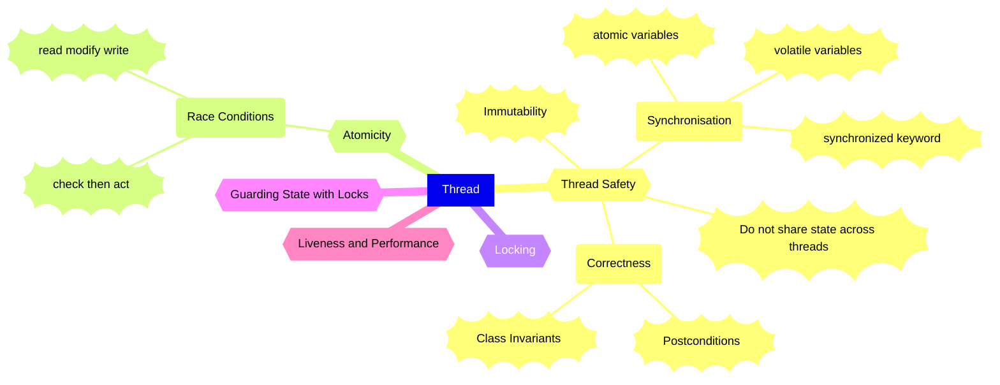

# Notes

```mermaid
mindmap
    root[Thread]
        id{{Thread Safety}}
            id(Synchronisation)
                id))synchronized keyword((
                id))atomic variables((
                id))volatile variables((
            id))Immutability((
            id))Do not share state across threads((
            id(Correctness)
                id))Class Invariants((
                id))Postconditions((
        id{{Atomicity}}
            id(Race Conditions)
                id))check then act((
                id))read modify write((
        id{{Locking}}
        id{{Guarding State with Locks}}
        id{{Liveness and Performance}}
```
